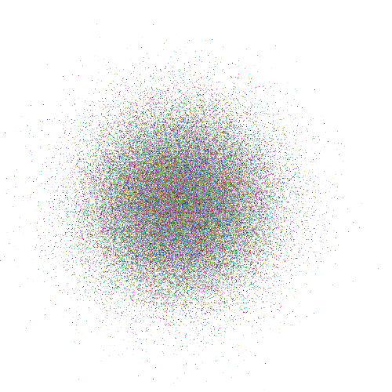
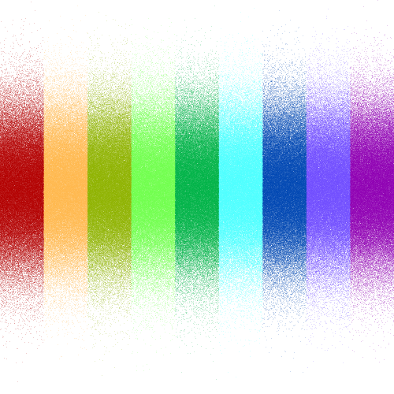
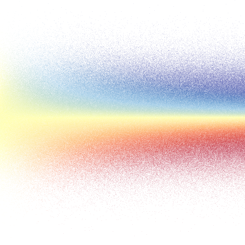

# GigaScatter.jl

Fast rasterization of huge amounts of tiny transparent points.

## How-To

First, get some data -- you will need point coordinates and their colors (in RGBA).

```julia
points = randn(2,100000)
colors = rand(4,100000)
```

After that, create a raster (of size 500x500):

```julia
using GigaScatter

raster = rasterize((500,500), points, colors)
```

The raster is now basically a 4-layer matrix with channels; you can write it to PNG and see what it looks like:

```julia
savePNG("demo-random.png", raster)
```



## Supporting functions

### Point size

For efficiency, points are not plotted as large immediately during rasterization, but you can later expand them by a kernel function (the results are same, but the kernel method is more efficient if you have more individual points than pixels in the resulting image, which is in fact common).

This expands the pixels to circles of radius `3.5`:

```julia
rasterWithBigPoints = rasterKernelCircle(3.5, raster)
```

### Colors

There are helper functions for coloring the points based on the class/category, and based on a real value (e.g. expression of some marker).

To plot categorical colors, you will need an integer array of categories (we create one manually from the data here):
```julia
points = vcat(randn(1000000)', rand(1000000)')
colors = classColors(
	# numerically scale and truncate the floats to 10 categories
	Array{Int64,1}(trunc.(points[2,:]*9) .+ 1),
	# create a rainbow-like palette which is pretty good for categories
	clusterPalette(10, alpha=.2))
raster = rasterize((500,500), points, colors)
savePNG("demo-classes.png", raster)
```


The same can be done with continuous properties of points, available as floating-point data:
```julia
# make some arbitrary floating point numbers from the data
vals = points[1,:] .* points[2,:]
colors = expressionColors(
	# scale the data into interval 0..1, required by expressionColors
	scaleNorm(vals), # (the other choice is scaleMinMax)
	# create a RdYlBu-like palette with enough levels for continuous data
	expressionPalette(256, alpha=.1))
raster = rasterize((500,500), points, colors)
savePNG("demo-values.png", raster)
```


### Transparency and background

By default, the raster is transparent. You can add an optionally colored background:

```julia
rasterOnWhite = solidBackground(raster)
rasterOnLightGray = solidBackground(raster, [0.5, 0.5, 0.5])
```

After the alpha channel is removed, saved PNGs will be slightly smaller, and you will be also able to export JPEG images (that cannot handle the alpha channel):
```julia
saveJPEG("demo-no-alpha.jpg", rasterOnLightGray)
```

